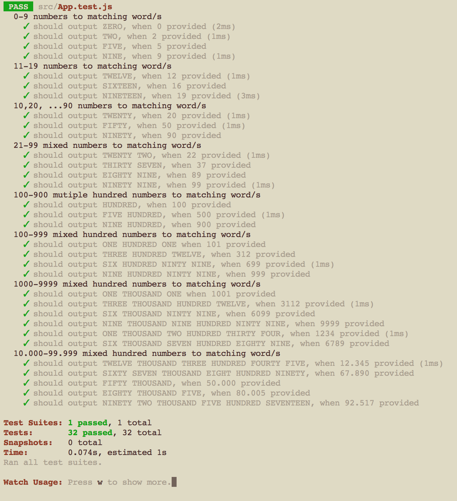

## Number2Words exercise

## Information

This exercise is to come up with an algorithm flexible enough to turn number in Arabic numbers into matching words. **JEST** tests were written to **TDD** the development, **create-react-app** to scaffold the basic app set up.

## Instruction
- Once download is complete ```yarn install```
- Kickstart test suite in command line this with ```yarn test```


## Steps completed
- **TDD development**, tests written in **JEST**
- test coverage and script working for numbers up to 1000

## To do
- refactoring needed (increased complexity) over 1000
- repetition of get_ten_thousands(n) / get_thousands(n) / get_hundreds(n) = DRYing needed
- recursion to create more robust solution

## Screenshot

